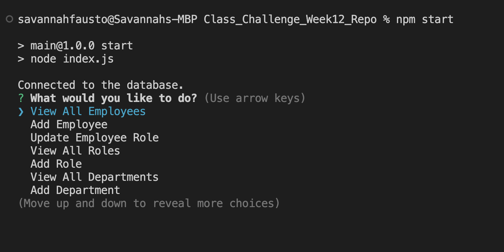
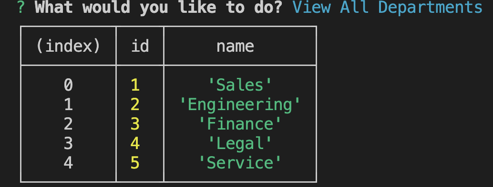
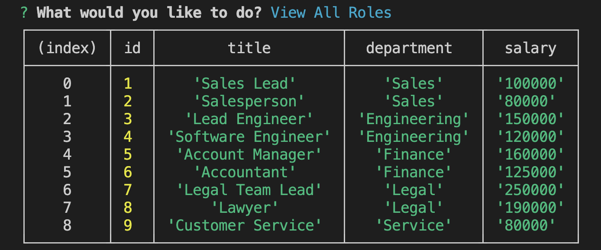
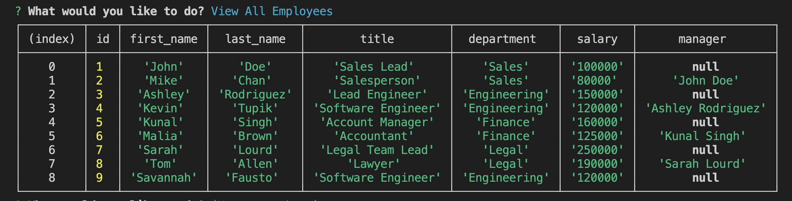
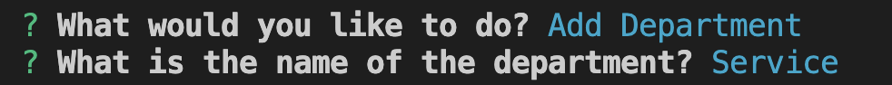
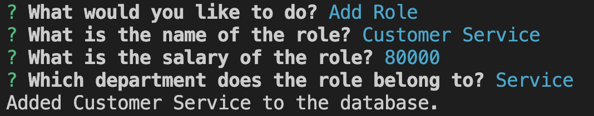
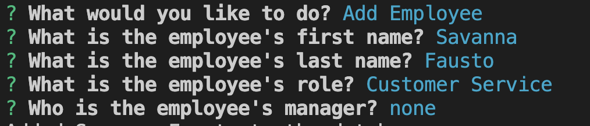
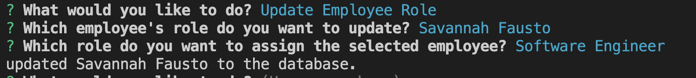

# A Breakdown of SQL Challenge: Employee Tracker

## Description

The motivation behind creating this project was to create an interface that allows non-developers to easily view and interact with information stored in databases. In this case, a content management system (CMS).

This project was built as a command-line application to view departments, roles and employees within a certain company. This application allows a user to add departments, roles and employees as needed and even update an employee, as well.

This project is an easy to use application that keeps a company's employer data in one easy to read place.

This project delves into queries with mySQL and how to display data using the inquirer package.

## Table of Contents 

- [Installation](#installation)
- [Usage](#usage)
- [Contribution](#contribution)
- [Questions](#questions)

## Installation

Steps required to install your project: 

In order to install this project, please clone [this repository](https://github.com/savannahfausto/Fausto_Employee_Tracker) to your local computer. Log in to your mysql and run source schema.sql and source seeds.sql to access the database and the given data. Then exit out of the mySQL shell and run npm install. Then, run npm start in order to access the applications menu. This is what the applications menu looks like:

From there you should be able to access the different menu options. 

## Usage

Find below instructions and examples for project use. 

Within this application you are able to view the departments, roles and employees within the company as tables. 

You can also add new departments, roles and employees. 

Finally, you can update an employee. 

Here is a link to a walkthrough video demonstrating the applications functionality: 

[Employee Tracker Walkthough Video Link](https://drive.google.com/file/d/1oQmKWlI78GSKxwUjks5rwCj0yR-X4ycs/view)

## Contribution

I am currently not taking contributions from other developers right now, but please feel free to contact me with questions.

## Questions

Thank you so much for taking interest in this project. If you have any questions or feedback please reach out to me: 

My github profile is: 
[GitHub Link](https:///github.com/savannahfausto)

My email is: 
[savannahfausto@gmail.com](mailto:savannahfausto@gmail.com)
